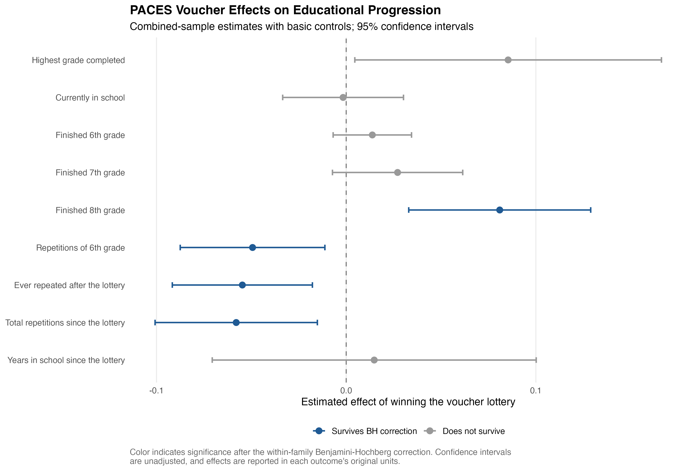
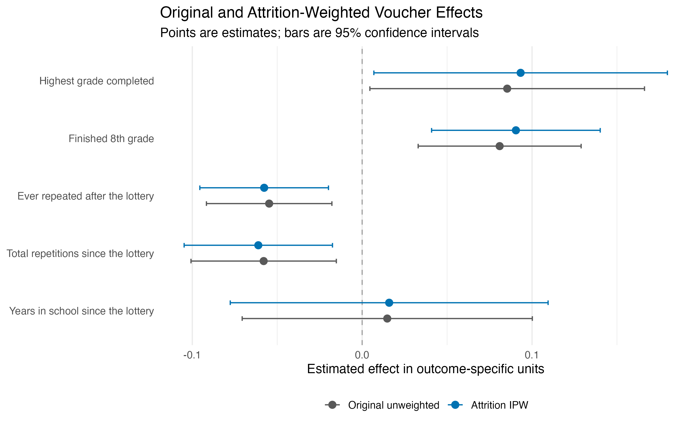

# PACES Replication and Robustness Analysis

This project provides an independent R replication and extension of selected results from Angrist et al. (2002), *Vouchers for Private Schooling in Colombia: Evidence from a Randomized Natural Experiment*.

The original study evaluates Colombia's PACES school-voucher program using lotteries that randomly assigned vouchers among eligible applicants. This repository reconstructs three central tables from the paper and adds two robustness analyses addressing multiple hypothesis testing and survey attrition.

## Analysis

### Core replication

The project replicates:

- **Table 2:** Personal characteristics and voucher status across applicant, attempted-contact, completed-survey, and test-taker samples.
- **Table 3:** Reduced-form effects of winning a voucher on scholarship use, private-school attendance, grade progression, and repetition.
- **Table 7:** OLS and instrumental-variables estimates using voucher assignment as an instrument for scholarship use, including the corresponding first-stage estimates.

The regressions use the sample definitions and control specifications described in the paper. Heteroskedasticity-consistent HC0 standard errors are reported throughout.

### Robustness extensions

#### Benjamini–Hochberg multiple-testing correction

Table 3 reports estimates for 14 outcomes. Evaluating each outcome independently increases the probability of obtaining statistically significant results by chance.

The extension applies the Benjamini–Hochberg false-discovery-rate adjustment:

- Within the program-take-up and school-sector family.
- Within the educational-progression family.
- Across all 14 outcomes jointly.

The largest effects on scholarship use and private-school attendance remain statistically significant after adjustment. The effects on finishing eighth grade and several grade-repetition outcomes also survive the within-family correction. The estimate for highest grade completed is significant using its raw p-value but not after the within-family adjustment.

#### Attrition and inverse-probability weighting

Only about 54 percent of attempted contacts completed the follow-up survey. The attrition extension therefore:

1. Tests whether survey response is associated with voucher assignment.
2. Estimates response probabilities using voucher status, application cohort, and available baseline characteristics.
3. Constructs inverse-probability weights for survey respondents.
4. Compares the original unweighted estimates with attrition-adjusted estimates.

Voucher assignment is not significantly associated with response in the pooled sample. The inverse-probability-weighted estimates are close to the original estimates, suggesting that reweighting for observable differences in response does not materially change the main conclusions.

For example, the estimated effect on finishing eighth grade changes from 0.081 in the original specification to 0.091 after weighting. The estimated effects on grade repetition are similarly stable.

## Repository structure

| Path | Purpose |
|---|---|
| `00_run_all.R` | Runs the complete replication and extension pipeline |
| `R/01_clean.R` | Loads the raw files and constructs analysis samples |
| `R/02_table2.R` | Replicates Table 2 |
| `R/03_table3.R` | Replicates Table 3 |
| `R/04_table7.R` | Replicates Table 7 and its first stages |
| `R/05_bh_correction.R` | Applies Benjamini–Hochberg corrections to Table 3 |
| `R/06_attrition_ipw.R` | Conducts response and inverse-probability-weighting analyses |
| `data/raw/` | Contains the original replication files |
| `output/tables/` | Contains machine-readable and formatted results |
| `output/figures/` | Contains PNG and PDF versions of the extension figures |

## Data

The repository includes the four original data files required to reproduce the analysis:

```text
data/raw/aerdat4.sas7bdat
data/raw/tab5v1.sas7bdat
data/raw/tab7.sas7bdat
data/raw/tab7test.sas7bdat
```

## Requirements

The analysis requires R-Studio and the following packages:

```r
install.packages(
  c(
    "AER",
    "haven",
    "lmtest",
    "purrr",
    "sandwich",
    "tidyverse"
  )
)
```

The `stats` package is also used but is included with base R.

## Reproduction

1. Download or clone this repository.
2. Open `paces-replication-and-robustness.Rproj`.
3. Run the master script by typing this into the console and running the line.

```r
source("00_run_all.R")
```

The master script:

- Verifies that all required analysis scripts exist.
- Creates the output directories if necessary.
- Runs cleaning, replication, and extension scripts in order.
- Stops if a validation check or analysis step fails.
- Saves all results in `output/tables/` and `output/figures/`.

After the script finishes, the reproduced tables and robustness-extension results can be found in `output/tables/`. The extension figures can be found in `output/figures/`.

## Outputs

### Replication tables

- `table2_results.csv`
- `table2_formatted.csv`
- `table3_results_long.csv`
- `table3_results_display.csv`
- `table7_results.csv`
- `table7_formatted.csv`
- `table7_first_stage.csv`

### Multiple-testing extension

- `table3_bh_results.csv`
- `table3_bh_results_formatted.csv`
- `table3_bh_coefficient_plot.png`
- `table3_bh_coefficient_plot.pdf`



### Attrition extension

- `attrition_response_tests.csv`
- `attrition_weight_balance.csv`
- `attrition_ipw_results.csv`
- `attrition_ipw_coefficient_plot.png`
- `attrition_ipw_coefficient_plot.pdf`



## Implementation notes

- The public replication data produce a test-taker male loser mean of 0.452 using `SEX2`, compared with 0.447 in the published Table 2. This project retains `SEX2` because it is also the dependent variable in the authors' treatment-effect regression and is observed for all 124 test-taker lottery losers.
- As in the original paper, the combined-sample specification for finishing eighth grade excludes the Bogotá 1997 cohort because that cohort had not had sufficient time to reach eighth grade.
- Some specifications contain sparse or collinear nuisance controls that trigger a high-leverage warning from `sandwich::vcovHC()`. The master runner selectively muffles this known diagnostic. Validation checks confirm that all reported voucher-effect estimates and standard errors are finite.
- The inverse-probability-weighted results address attrition related to observed application characteristics. They do not eliminate the possibility of selection on unobserved characteristics.

## References

Angrist, Joshua D., Eric Bettinger, Erik Bloom, Elizabeth M. King, and Michael Kremer. 2002. “Vouchers for Private Schooling in Colombia: Evidence from a Randomized Natural Experiment.” *American Economic Review* 92 (5): 1535–1558.  
<https://doi.org/10.1257/000282802762024629>

## Author

Zachary Etzioni